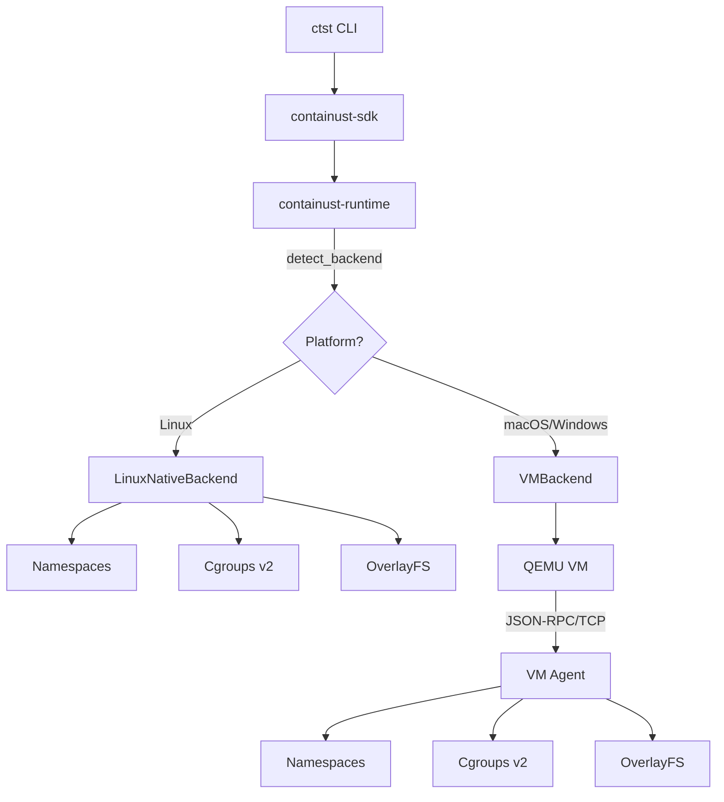
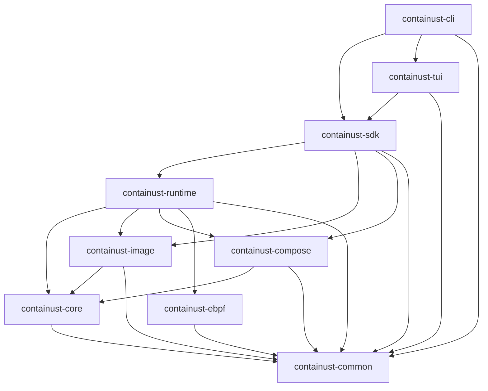

# Architecture

This document describes the crate architecture, dependency rules, and design decisions of the Containust workspace.

## Crate Map

```
containust-cli ──────────► containust-sdk ──────────► containust-runtime
    │                          │    │                      │    │
    ▼                          │    │                      │    ▼
containust-tui ────────────────┘    │                      │ containust-ebpf
                                    ▼                      │    │
                             containust-compose            │    │
                                    │                      │    │
                                    ▼                      ▼    │
                             containust-core ◄─── containust-image
                                    │                      │
                                    ▼                      │
                             containust-common ◄───────────┘
```

## Layer Responsibilities

### Common Layer — `containust-common`

The foundation crate with zero internal dependencies. Contains:
- `error.rs` — Unified `ContainustError` enum (via `thiserror`).
- `types.rs` — Domain primitives: `ContainerId`, `ImageId`, `Sha256Hash`, `ResourceLimits`, `ContainerState`.
- `config.rs` — `ContainustConfig` model with default paths and runtime options.
- `constants.rs` — System paths, file extensions, limits, and application metadata.

**Rule**: No algorithms, no I/O, no business logic. Pure data definitions.

### Core Layer — `containust-core`

Safe abstractions over Linux kernel primitives:
- `namespace/` — PID, Mount, Network, User, IPC, UTS namespace creation and joining.
- `cgroup/` — Cgroups v2 resource management (CPU, memory, I/O) via `/sys/fs/cgroup`.
- `filesystem/` — OverlayFS mounting, `pivot_root(2)`, bind mounts, essential pseudo-fs setup.
- `capability.rs` — Linux capability dropping with allowlist semantics.

**Rule**: All `unsafe` blocks encapsulated in safe wrappers with `// SAFETY:` justification.

### Engine Layer

#### `containust-image`
Image and layer lifecycle:
- Content-addressed layer cache with SHA-256 verification.
- Local storage backend for on-disk image management.
- Source protocol handlers: `file://`, `tar://`, remote (opt-in).
- FUSE lazy-loading for fast container startup.

#### `containust-runtime`
Container lifecycle management:
- Container struct with state machine (Created → Running → Stopped → Failed).
- Process spawning inside isolated namespaces with chroot isolation.
- Persistent state index (`state.json`) for daemon-less management.
- Namespace joining for `exec` operations via `nsenter`.
- Real-time metrics collection from cgroup v2 stat files.
- Container log management with append-only log files (`logs.rs`).
- Platform-agnostic backend trait (`ContainerBackend`) with Linux native and VM implementations (`backend/`).
- Runtime engine that orchestrates `.ctst` deployments through the compose layer (`engine.rs`).

##### `ContainerBackend` Trait

The `ContainerBackend` trait abstracts all platform-specific container operations:

```rust
pub trait ContainerBackend: Send + Sync {
    fn create(&self, config: &ContainerConfig) -> Result<ContainerId>;
    fn start(&self, id: &ContainerId) -> Result<u32>;
    fn stop(&self, id: &ContainerId) -> Result<()>;
    fn exec(&self, id: &ContainerId, cmd: &[String]) -> Result<ExecOutput>;
    fn remove(&self, id: &ContainerId) -> Result<()>;
    fn logs(&self, id: &ContainerId) -> Result<String>;
    fn list(&self) -> Result<Vec<ContainerInfo>>;
    fn is_available(&self) -> bool;
}
```

Two implementations exist:

| Implementation | Module | Platform | Mechanism |
|---|---|---|---|
| `LinuxNativeBackend` | `backend/linux.rs` | Linux | Direct syscalls: `clone(2)`, `unshare(2)`, cgroups v2, OverlayFS |
| `VMBackend` | `backend/vm/mod.rs` | macOS, Windows | QEMU VM with JSON-RPC over TCP to a BusyBox-based guest agent |

Backend selection is automatic via `detect_backend()`, which uses compile-time `#[cfg(target_os)]` on Linux and runtime QEMU detection on other platforms.

##### VM Module Structure

The VM backend is split across two files for maintainability:

- `backend/vm/mod.rs` — QEMU process management, JSON-RPC client with retry logic, port forwarding, VM lifecycle.
- `backend/vm/initramfs.rs` — Custom initramfs builder that injects an init script and a BusyBox-based TCP agent into the Alpine Linux initramfs using CPIO newc format manipulation.

The agent inside the VM is a pure shell script (no cross-compiled Rust binary needed) using BusyBox `nc`, `chroot`, and standard POSIX utilities to manage container lifecycles.

#### `containust-compose`
`.ctst` language processing:
- Parser built on `nom`: lexer → AST → validator pipeline.
- Dependency graph construction and topological sorting via `petgraph`.
- Auto-wiring resolver for connection environment variables.
- IMPORT resolution from local and remote sources.
- Distroless analyzer using ELF binary dependency scanning.

### Observability Layer — `containust-ebpf`

eBPF-based container monitoring (optional, feature-gated):
- Syscall tracing via tracepoints.
- File open monitoring.
- Network socket/connection tracking.
- eBPF programs loaded via `aya`.

### SDK Layer — `containust-sdk`

Public facade for using Containust as a library:
- `ContainerBuilder` — Fluent API for container configuration and launch.
- `GraphResolver` — High-level `.ctst` loading and dependency resolution.
- `EventListener` — Async event stream for lifecycle monitoring.

**Rule**: The SDK is the only crate that external consumers should depend on directly.

### CLI Layer

#### `containust-cli`
The `ctst` binary with subcommands: `build`, `plan`, `run`, `ps`, `exec`, `stop`, `logs`, `images`, `convert`, `vm`.
Uses `clap` for argument parsing and `anyhow` for error reporting.

#### `containust-tui`
Interactive terminal dashboard built with `ratatui`:
- Dashboard view with container table.
- Container detail view with config and live metrics.
- eBPF trace log viewer.

## Dependency Rules

Dependencies flow strictly downward through the layers. The complete allowed-dependency table:

| Crate | Allowed Internal Dependencies |
|---|---|
| `containust-common` | None |
| `containust-core` | `containust-common` |
| `containust-image` | `containust-common`, `containust-core` |
| `containust-runtime` | `containust-common`, `containust-core`, `containust-ebpf`, `containust-image`, `containust-compose` |
| `containust-compose` | `containust-common`, `containust-core` |
| `containust-ebpf` | `containust-common` |
| `containust-sdk` | `containust-common`, `containust-runtime`, `containust-image`, `containust-compose` |
| `containust-tui` | `containust-common`, `containust-sdk` |
| `containust-cli` | `containust-common`, `containust-sdk`, `containust-tui` |

**Violations of this table are build-breaking errors.**

## Storage Architecture

Containust uses a **two-tier storage model** that separates shared immutable assets from per-project mutable state:

| Tier | Location | Contents | Lifecycle |
|------|----------|----------|-----------|
| **Global cache** | `~/.containust/cache/` | Alpine kernel, base initramfs, custom initramfs | Downloaded once, shared across all projects |
| **Project state** | `.containust/` (sibling of `.ctst` file) | Container state, logs, image layers | Created per-project, removed with the project |

This design ensures:
- **Project isolation**: Each project's container state is self-contained. No cross-project interference.
- **Portability**: Moving a project directory preserves or cleanly detaches its state.
- **Clean global state**: Only immutable, content-addressed assets live in `~/.containust/`.

The `global_cache_dir()` and `project_dir()` functions in `containust-common/src/constants.rs` centralize path resolution.

## Design Decisions

### Why no daemon?
Traditional container runtimes use a root daemon for lifecycle management. Containust replaces this with a state file (`state.json`) and direct syscalls, eliminating a permanent attack surface.

### Why `pivot_root` over `chroot`?
`chroot` only changes the process's view of `/` — the old root remains accessible. `pivot_root` actually moves the root mount point, providing stronger isolation.

### Why OverlayFS?
OverlayFS enables efficient layer caching and copy-on-write semantics without duplicating filesystem data. Combined with content-addressed storage, this minimizes disk usage.

### Why feature-gated eBPF?
eBPF requires a modern Linux kernel and BPF support. Feature-gating it with `ebpf` allows the core runtime to work on systems without BPF, including development on macOS via cross-compilation.

### Why a VM backend on macOS/Windows?
Linux containers require Linux kernel primitives (namespaces, cgroups, OverlayFS). On non-Linux platforms, Containust boots a lightweight Alpine Linux VM (~50MB) via QEMU with hardware acceleration (HVF on macOS, Hyper-V/WHPX on Windows). Container operations are forwarded to the native Linux backend inside the VM via JSON-RPC over TCP, achieving sub-2s boot time and near-native performance.

## Platform Backend Architecture



## VM Lifecycle

The VM backend follows this lifecycle on macOS and Windows:

1. **Asset Provisioning** — On first run, the kernel (`vmlinuz-virt`) and initramfs (`initramfs-virt`) are downloaded from Alpine Linux CDN to `~/.containust/cache/vm/`. A custom initramfs (`initramfs-containust.img`) is built by injecting the init script and agent into the base image using CPIO newc format.
2. **Boot** — `ctst run` (or `ctst vm start`) launches QEMU with hardware acceleration (HVF on macOS, WHPX on Windows). The custom initramfs boots Alpine, creates essential directories, sets up networking, and starts the TCP agent on port 10809. Boot time is under 2 seconds.
3. **Connection** — The host CLI connects to the agent via `localhost:10809` (forwarded by QEMU). Retries with exponential backoff handle timing variability.
4. **Container Operations** — JSON-RPC requests (`create`, `start`, `stop`, `exec`, `logs`, `list`, `remove`) are sent over TCP. The agent uses `chroot` with BusyBox to isolate containers.
5. **Port Forwarding** — Container ports declared in `.ctst` files are forwarded by QEMU (`hostfwd`) from host to guest.
6. **Shutdown** — Ctrl+C or `ctst stop` sends `system_poweroff` via QEMU monitor, then kills the QEMU process. Container state is ephemeral within the VM.

## Module Dependency Graph (Mermaid)


